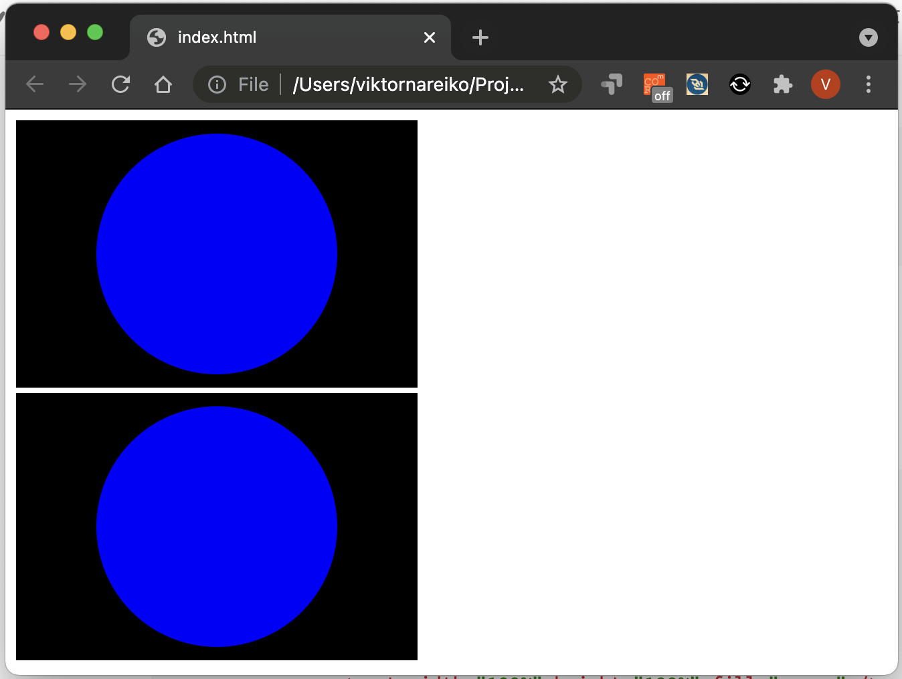

# Užduotis 1

* Sukurkite failą circle-in-rect.svg ir į jį įterpkite kodą:

```html
<svg version="1.1"
        baseProfile="full"
        width="300" height="200"
        xmlns="http://www.w3.org/2000/svg">
    <rect width="100%" height="100%" fill="black" />
    <circle cx="150" cy="100" r="90" fill="blue" />
</svg>
```

* Sukurkite html failą index.html ir pridėkite svg kaip paveikslą nauojant `` ir atidarykite jį naršyklėje.
* Į failą index.html įterpkite aukščiau pateiktą SVG kodo dalį. Atidarykite jį naršyklėje.

---

Turetume gautį toki rezultatą:

