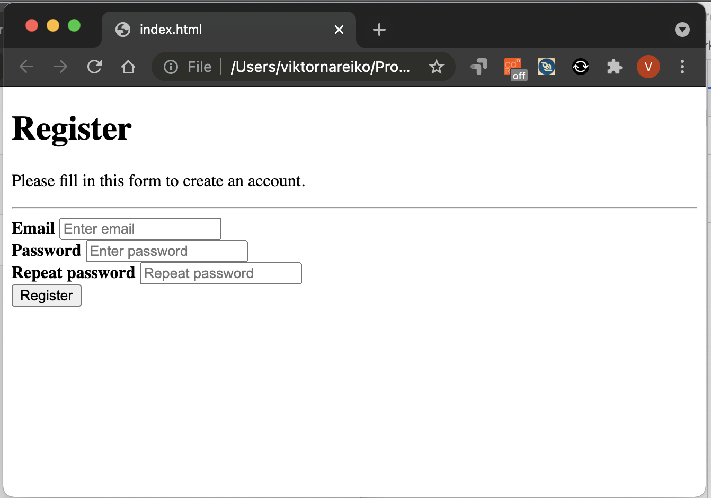

# Formos pavyzdis

```html
<form action="/action_page.php">
  <div class="container">
    <h1>Register</h1>
    <p>Please fill in this form to create an account.</p>
    <hr>
    <label for="email"><b>Email</b></label>
    <input type="text" placeholder="Enter email" id="email" required /><br />
    <label for="pwd"><b>Password</b></label>
    <input type="password" placeholder="Enter password" id="pwd" required><br />
    <label for="pwd-repeat"><b>Repeat password</b></label>
    <input type="password" placeholder="Repeat password" id="pwd-repeat" required /><br />
    <button type="submit" class="register-button">Register</button><br />
  </div>
</form>
```

---

