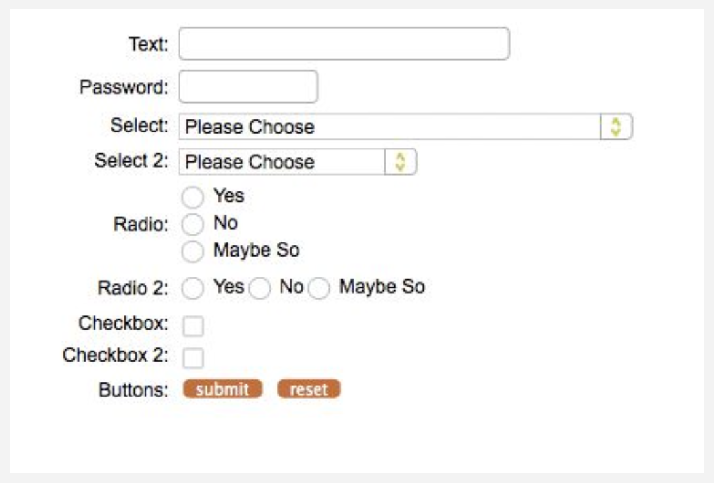

# HTML formos

* Tinklalapiuose dažnai yra formų skirtų informacijai išsaugoti.
* HTML apibrėžia kelias formos elementų žymas (ang. tags).
* Visi formos elementai, tokie kaip tekstinis laukas, mugtykas yra įterpiami į `<form>` žymą.
* `<form>` priima tokius atributus kaip metodas ir veiksmas - metodas nurodo
HTTP užklausos metodas (GET / POST), o veiksmas nurodo duomenis priimančios programos URL.

---

```html
<form method="POST" action="/crate_a_custumer.php">
    ...
</form>
```

---

