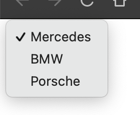

# select

Žyma `<select>` pateikia išskleidžiamąjį lauką su parinktimis, susietomis su žyma `<option>`. Atminkite, kad tikroji į serverį siunčiama vertė įrašoma į kiekvienos parinkties atributą "value"

---

```html
<select>
    <option value="mercedes">Mercedes</option>
    <option value="bmw">BMW</option>
    <option value="porsche">Porsche</option>
</select>
```

---

