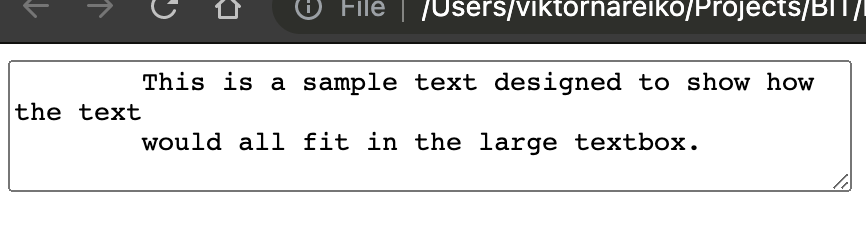

# textarea

`<textarea>` žyma (ang. tag) pateikia didelį teksto įvesties lauką. Įvesties dydį iš anksto galima nusakyti nustatytomis eilučių ir stulpelių atributais (row, column):

---

```html
<textarea rows="4" cols="50">
    This is a sample text designed to show how the text
    would all fit in the large textbox.
</textarea>
```

---

